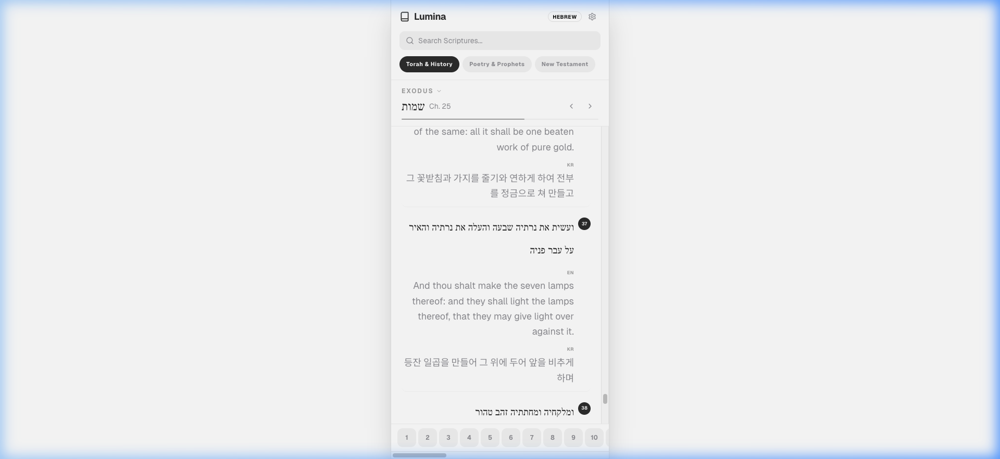
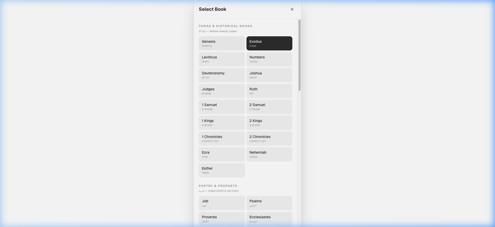
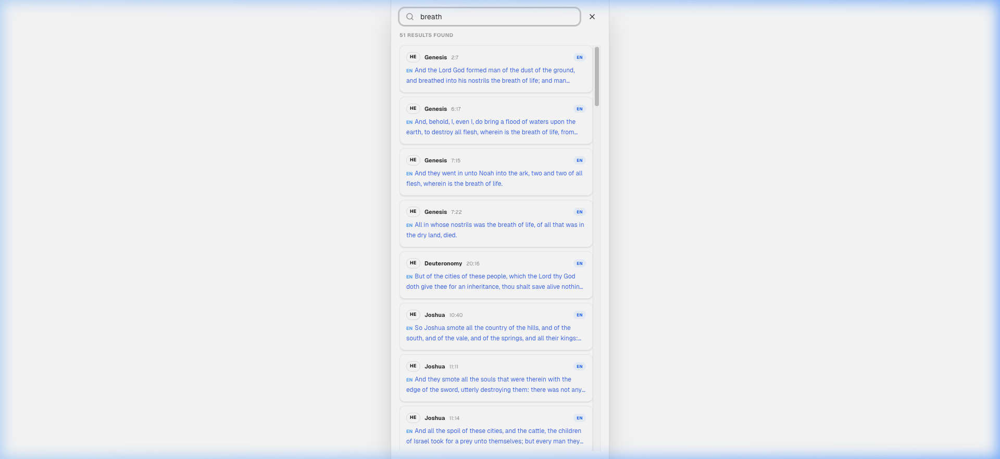
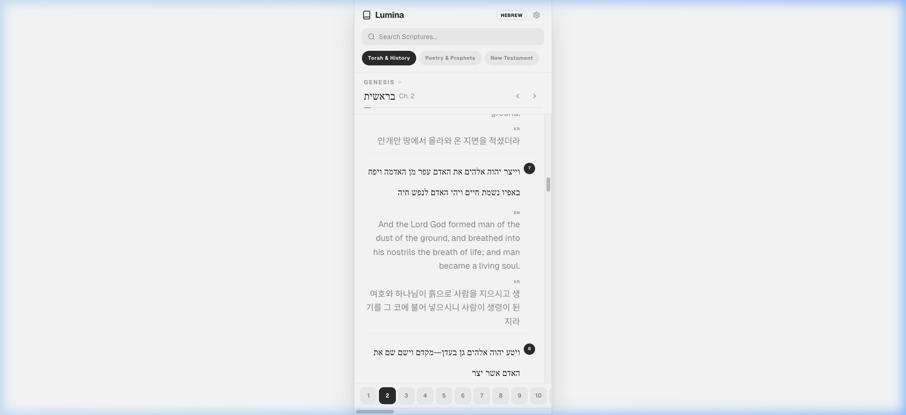
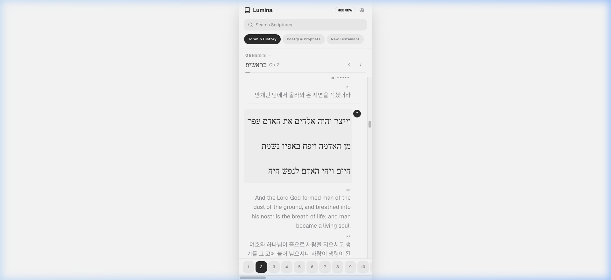

# How to Use Lumina Bible

Lumina Bible is a powerful, multi-language scripture study application designed for deep study of original texts alongside modern translations.

## 1. Main Interface Overview

The main view presents the original scripture text (Hebrew, Arabic, or Greek) as the primary focus, with optional English (KJV) and Korean (KRV) translations displayed below each verse.

- **Original Text**: displayed in the center.
- **Translations**: Toggle visibility via the Settings drawer (top right gear icon).

---

## 2. Navigation & Book Selection

You can easily navigate between different sections of the Bible.

1. **Change Book**: Click the **Book Name** (e.g., "Genesis") at the top to open the selection modal.
2. **Book Categories**: Books are grouped by language and testament (Torah & History, Poetry & Prophets, New Testament).
3. **Change Chapter**: Use the **Chapter Bar** at the bottom to jump to a specific chapter, or use the **Next/Prev arrows** ( < / > ) next to the chapter title.

---

## 3. Global Scripture Search

Lumina features a global, streaming search that looks through all books and all enabled languages simultaneously.

- **Streaming Results**: Results appear immediately as they are found. You can scroll the list while the search continues in the background.
- **Language Badges**: Each result shows which language it matched (Original, EN, or KR).
- **Context**: The search card shows the book, chapter, and verse for each result.

---

## 4. Verse Highlighting & Auto-Scroll

When you find a verse in the search results and click it, Lumina takes you directly there.

- **Auto-Scroll**: The app automatically scrolls the target verse into view.
- **Visual Glow**: The verse will be highlighted with a golden amber glow for a few seconds to help you locate it instantly.

---

## 5. Customizing Font Sizes

Readability is key. Lumina allows you to independently change the font size of the original text and the translations.

- **To Change Original Size**: Simply **tap or click** on any original scripture text. It will cycle through: *Small → Medium → Big → Very Big → Small*.
- **To Change Translation Size**: Tap on the **English or Korean** text to cycle their sizes independently.
- **Selection Support**: You can still select and copy words for lookup without triggering the font cycle; the cycle only triggers on a clean tap.

---

## 6. Offline Support (Desktop/Mobile)

Lumina is built with Tauri, meaning it can be run as a native desktop application (Windows, Mac, Linux) or mobile app.

- **Persistent Settings**: Your font size preferences and reading progress are automatically saved to your device.
- **Local Data**: Use the build scripts to download the entire Bible for offline usage.

---

## 7. Search Caching (Previous Search)

Lumina automatically remembers your most recent search session.

- **Instant Recall**: When you reopen the search bar, your last search query and all findings are displayed as a "Previous Search" list.
- **Save Across Sessions**: This cache persists even if you close the app or refresh the page.
- **Clear Cache**: Use the "Clear Cache" button within the search menu to reset your history.

---

## 8. Study Progress & Auto-Resume

Never lose your place again. Lumina tracks your study progress at the individual verse level.

- **Last Seen Verse**: As you scroll, the app intelligently tracks which verse is in the center of your screen.
- **Auto-Scroll**: When you return to the app, it automatically navigates to the correct Book and Chapter, and then smoothly scrolls down to the exact verse where you left off.
- **Reading Window**: The app uses an intersection detector (focusing on the middle 20% of your screen) to ensure your progress is saved accurately as you read.
